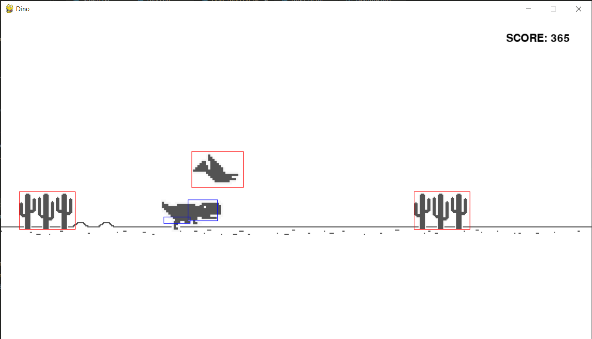

# Assignment 1: Dino

Dino is a simple implementation of Google Chrome T-Rex. The goal is to control tyrannosaurus so he won't collide with obstacles — cactuses and birds — for as long as possible, while it slowly accelerates. 

You can play it just by running [play_dino.py](play_dino.py) (by executing `python3 [path]/play_dino.py`). If you run it with no commands you can control T-Rex by yourself with keyboard arrows. Otherwise you can run the script with option `-h` to see all available options. Particularly you should be interested in option `-a Agent` which allows you to specify agent to control T-Rex.

## Agent implementation
### Game API
Before you start to implement your agent, you should look into script [game/dino.py](game/dino.py), that is complete implementation of the game. As you will find, there are not many getters or methods for interacting with the game state, however your agent will get reference to the current game state so you gain complete access to all components. You should use it as *read-only* variable but during debugging your agent you may modify the game state as you like. Note that ReCodEx tests won't allow you to do any modifications.

The game itself is just a plane with rectangles. All obstacles are stored in `game.obstacles` and they are represented by single rectangle that can be accessed by `obstacle.rect`. T-Rex consists of two rectangles — head and body — and you can access them by `game.dino.get_rects()`. Your goal is to prevent collisions T-Rex and obstacles for as long as possible so you might want to check `collision` methods of `Rect` and `Dino`. To avoid collision you provide which movement should T-Rex make, that will be realized by `Dino.tick` method.

### Agent
Your agent should implement interface given by `Agent` from [game/agent.py](game/agent.py), i.e. it should implement single static method `get_move`. Keep in mind that your agent won't be initialized since it is a *simple-reflex agent*, only its class variables `verbose` and `debug` will be set with respect to game options. Your static agent class should be implemented in script with name "class_name_lowercase.py", so you can use it to play the game.

You can implement your agent in prepared script [agents/myagent.py](agents/myagent.py).
Example of agent implementation can be found in [agents/dummy_agent.py](agents/dummy_agent.py).

### Visual debugging
For easier debugging you can run the game with option `-d` that allows your to visualize rectangles, lines and texts by calling methods of `DebugGame` class either from [play_dino.py](play_dino.py) — `add_initial_debug_visualization` method or from your agent. 

You can find example of this usage in [agents/dummy_agent.py](agents/dummy_agent.py).

### Hints
Take in account that speed of all obstacles is slowly increasing and that some birds are not static along x-axis.
