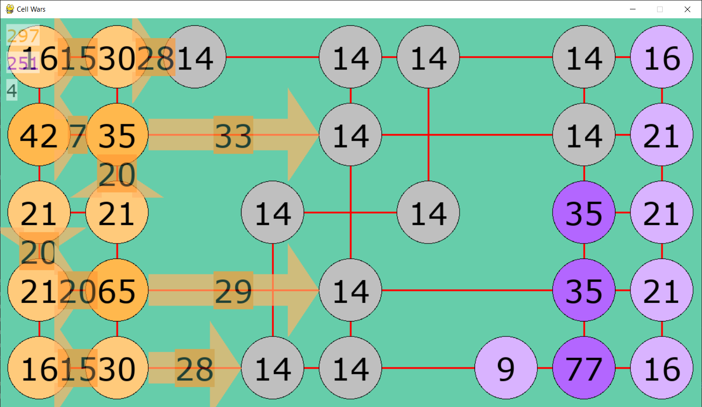

# Assignment 4: Cell Wars
This assignment consists of two parts — implementation of search algorithm and implementation of agent playing [Cell Wars](cells/README.md).

## 1. Search Algorithm

Implement either
- the minimax with alpha-beta pruning
- Monte Carlo tree search (MCTS)

Your algorithms will implement interface `Strategy` that can search any game implementing interface `AbstractGame`. You can find these implementations in [minimax_templates.py](minimax_templates.py).

 A Strategy represents a strategy for playing a game. It is essentially a function which, given a state, decides what action the current player should take.

### Minimax
For minimax you will need extended game interface `HeuristicGame` that brings method `evaluate`. 

`evaluate` is a heuristic evaluation function that can estimate the expected outcome of the game at any state. You will need to use this evaluation function when you cut off the search because it has reached its maximum depth.

You have to implement your strategy `Minimax` to [minimax.py](minimax.py). The `limit` in the constructor represents a search depth. For example, if `limit` is 2, your `action` method should consider all possible sequences of 2 actions from the given state. If `limit` is 0, there is no depth limit and you should search the entire game tree.

Your implementation should include alpha-beta pruning.

#### Hints
- Don't forget to clone the game state before applying an action as you descend the game tree recursively.
- At a leaf node representing a completed game, it's best to call the `outcome` method to find the node's value. (In theory `evaluate` should return the same value for a completed game, but that is not guaranteed.)
- Your minimax implementation should adjust its computed minimax values so that a win in fewer moves is favored over a win that will come later. (And, equivalently, a loss that happens later is not as bad as a loss that occurs sooner.) This may significantly improve its performance against weaker players. That's because if all wins or losses are considered equal, then if minimax discovers that it is in a position in which will it will lose if the opponent plays perfectly, it will consider all moves to be equally bad, and is likely to make a foolish move that allows the opponent to win immediately. But if it favors moves that will put off the loss until later, that gives the opponent (who may not see so far ahead) an opportunity to make a move that is less than perfect, which salvages the game.
- For debugging, you can print out all moves and their minimax values up to the search depth indicated by debugLevel. This will be useful not only for debugging your Minimax class itself, but also for seeing why your agent makes the moves it does with any given heuristic function.

### Monte Carlo tree search
You have to implement your strategy `MCTS` to [mcts.py](mcts.py). The `base_strat` is a strategy implementing the playout policy to be used for simulations. The `limit` in the constructor represents the number of iterations. Each iteration includes a node expansion and a playout.

#### Hints
- Be sure to clone the game state in two situations: 
  a) before you apply an action while expanding a node;
  b) before you begin a simulation from a newly created node.
- For debugging, each time that MCTS chooses an action you could print out the number of wins and number of playouts in each node below the root. This will be very helpful for seeing why your agent behaves the way it does.
- You could also add a method `report_stats` that reports statistics aggregated over the entire lifetime of a `Mcts` object. The following might be especially useful for performance optimization:
  - average iteration time
  - average number of simulation steps per iteration (i.e. the average playout length)
  - average time per simulation step

### Testing
The AI repository contains several sample games that implement the interfaces above: TrivialGame, Tic-Tac-Toe, and Connect Four.

TrivialGame is, well, trivial. In this game, there are only two moves. The first player chooses a number from 1 to 3, then the second player chooses a number from 1 to 3. Then the game ends; the player with the higher number wins. If the numbers are the same, the game is a draw. Although this game is extremely simple, it may be useful as a first test of your algorithm's functionality.

Of course you are already familiar with Tic-Tac-Toe, and probably with Connect Four as well.

All of the sample games implement the `HeuristicGame` interface, so they will work with minimax. However, for TrivialGame and Tic-Tac-Toe the `evaluate` function just returns a dummy value. For Connect Four, the `evaluate` function computes a heuristic by scanning the board and looking for groups of adjacent stones that contain discs of the same color.

You can run each of the sample games by running the game script [game_main.py](game_main.py) with parameters specifying played game and chosen strategies. Specify one strategy on the command line to play as a human against that strategy, or two strategies to have them play each other. Use the `--sim` option to run a series of simulated games. Using these options, you should be able to debug your implementation. You may also find it interesting to see how it does against various strategies as you vary its parameters.

The following strategies are available for all the sample games:
- random – plays randomly
- minimax:\<depth\> - runs minimax with the given search depth, or 0 for unlimited depth
- mcts:\<iterations\>/\<base-strategy\> - Monte Carlo tree search with the given number of iterations and base strategy


Of course, the 'minimax' and 'mcts' strategies will only work if you implement them, i.e. write the Minimax or Mcts classes. :)

For each game, there are one or more additional strategies available:
- Trivial
  - *perfect* — a perfect player (always choses 3)
- Tic-Tac-Toe
  - *basic* — plays a move that wins immediately if possible, otherwise blocks an immediate win by the other player if possible, otherwise makes a random move
- Connect Four
  - *basic* — plays a move that wins immediately if possible, otherwise blocks an immediate win by the other player if possible, otherwise makes a random move
  - *heuristic* — plays a move that wins immediately if possible, otherwise blocks an immediate win by the other player if possible, otherwise makes the move that gives the largest immediate gain in the evaluation heuristic

Here are a few examples showing how to launch these sample games:

    $ python3 game_main.py trivial minimax:0 random --sim 100

- Run 100 games of TrivialGame in which minimax (with no depth limit) plays versus a random strategy.

```
$ python3 game_main.py tictactoe mcts:100/random basic --sim 100 -v
```

- Run 100 games of Tic-Tac-Toe in which MCTS (with 100 iterations, and using 'random' as the base strategy) plays against 'basic'. Print verbose output, i.e. show the random seed and outcome of each game.
```
$ python3 game_main.py tictactoe mcts:100/random basic --seed 22
```

Watch MCTS (with 100 iterations, and using 'random' as the base strategy) play Tic-Tic-Toe interactively against 'basic', with seed 22.
```
$ python3 game_main.py connect_four heuristic
```
- Play Connect Four interactively against 'heuristic'.

---

If your implementation of minimax or MCTS is correct, here is how you should do against these games:

- In TrivialGame, you will defeat a random strategy 67% of the time, and will always draw against the perfect strategy.

- In Tic-Tac-Toe, you should win at least 70-80% of games versus 'basic' as player 1. As player 2, you should win at least 15% of games versus 'basic' and should never lose. With MCTS you might need a few hundred iterations to achieve these win rates, and might need at least 500-600 iterations in order to never lose a game.

- In Connect Four, minimax with a search depth of 4 should win against 'heuristic' at least 80% of the time. MCTS seems very strong in Connect Four: I've found that it wins about 95% of the time against 'heuristic' with only 200 iterations using 'heuristic' as the base strategy.


## 2. Cell Wars


### Game 

The game is a combination of classic board game [Risk](https://en.wikipedia.org/wiki/Risk_(game)) (or PC game Warlight) and mobile game Cell Expansion Wars. The goal is to occupy all cells, where cells form an undirected graph as in the picture above. There are owned cells, enemy cells and neutral cells, where each of those has exact mass. Each turn can each player cell transfer its mass to one neighbor cell. When mass is transferred to cell that is not controlled by the same player, mass in target cell is lowered or target cell become owned by the sender. After both players make their transfers, all cells grow, where bigger cells and cells with all neighbors controlled by same player grow faster.

The game ends when a player lose all cells or when the round limit is reached.

### Task

Implement an agent that plays Cell Wars. You may use your minimax (or MCTS) implementation from previous section, or another approach if you prefer.

Assuming you will use minimax or MCTS, you will need the following:
- Class `CellGame` implementing `HeuristicGame` for minimax, or `AbstractGame` for MCTS (can be found in [minimax_templates.py](minimax_templates.py)).
- In the `actions` method, you should return only selection from all possible actions to reduce effective branching factor.
- If you are using minimax, you will need to invent an evaluation function.
- If you are using MCTS, you will need a base strategy to be used for simulations, i.e. rollouts. You could use a strategy that plays randomly, or the strategy played by one of the existing agents, or could invent your own strategy for this purpose. Note that playout simulation is really expensive operation, so you will need to find some way how to deal with that or you can just use minimax.

Before you start implementing you should check [documentation](cells/game/doc.md).

### Controls
#### Visualization of agent games
| Command                          | Purpose                           |
| -------------------------------- | --------------------------------- |
| *Enter*/*Spacebar*/*mouse-click* | Show next move.                   |
| *F*/*+*                          | Turn on/speed up game animation.  |
| *S*/*-*                          | Turn on/slow down game animation. |
| *P*                              | Turn off animation.               |
| *Escape*                         | Exit the visualization.           |

#### Game-play
Note that since you need to make transfer from many cells, game-play of this game is not really comfortable.

To create transfer you need to select two cells by *left-click*. After selecting the first one it changes color and you can modify this selection by *right-click* or cancel it by *Escape*.

Once you select two cells you need to specify transferred mass by typing the number. By pressing *Enter* you confirm the transfer, *Escape* cancels it and *Backspace* erase last digit of the specified mass.

Once you create transfer you can modify it by *left-click* or delete it by *right-click*. After you create all desired transfers you can end your turn by pressing *Enter*.

### ReCodEx testing
You are expected to submit two files. First, minimax.py with your implementation of Minimax algorithm or mcts.py with your implementation of Monte-Carlo tree search algorithm. Second, a file containing your agent class playing Cells game.

The first set of tests examines your minimax/mcts implementation by playing games trivial, tictactoe, and connect_four. In each test, your algorithm will be playing a number of games as the first player and as the second player. You are expected to beat the opponent a sufficient number of times and to pass a time limit set in recodex. The exact limits are in the following table.

| game         | simulations | minimax setting | mcts setting       | opponet   | 1st min. wins | 1st max. loses | 2nd min. wins | 2nd max. loses | max points |
|--------------|-------------|-----------------|--------------------|-----------|---------------|----------------|---------------|----------------|------------|
| trivial      | 100         | minimax:0       | mcts:200/random    | random    | 60            | 0              | 60            | 0              | 3          |
| tictactoe    | 100         | minimax:0       | mcts:200/basic     | basic     | 75            | 2              | 15            | 5              | 5          |
| connect_four | 50          | minimax:4       | mcts:200/heuristic | heuristic | 40            | 8              | 40            | 8              | 7          |

The second test plays 50 rounds of Cells game against one of the provided agents. The timelimit is 10 minutes. There is a limit on the number of turns the game may last, if the limit is exceeded, the game ends in a draw. Based on the performance of your agent, you earn a score = wins - loses/2. The score determines the number of points you earn in recodex with 10 being the maximum. The minimal score to earn 1 point is 9, for a score of 15 and more, you receive the full 10 points. The parameters of the game are "-c 10 20 --swap --seed=HIDDEN -m=100 -s=50".
