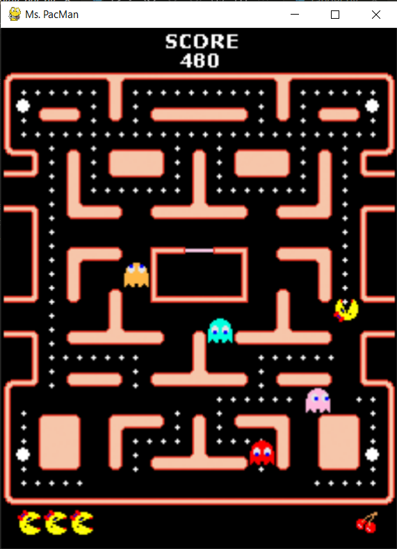

# Assignments 2 and 3
[Scroll to Assignment 3](#assignment-3-sokoban)

## Assignment 2: Pac-Man


This assignment consist of two parts — implementing uniform-cost search and agent for Pac-Man game.
### 1. Uniform-cost search
Write general-purpose implementation of uniform-cost search in [ucs.py](ucs.py). It should be able to search any problems implementing `Problem` interface, that can be found in [search_templates.py](search_templates.py). The search should return `Solution` instance if solution is found, otherwise null.

Search method could be used like this:
```python
problem: Problem = SomeProblem()
solution: Solution = ucs(problem)
```

## Assignment 3: Sokoban
