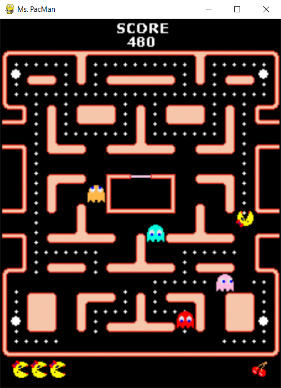

# Pac-Man

In this part of the assignment, you write an agent that plays Pac-Man. Your uniform-cost search from the [previous part](../README.md#1-uniform-cost-search) of the assignment might be helpful.

To play the game you need to run [play_pacman.py](play_pacman.py). If you run it with no commands you can control Pac-Man by yourself with keyboard arrows. Otherwise you can run the script with option `-h` to see all available options. Particularly you should be interested in option `-a Agent` which allows you to specify agent to control Pac-Man.

## Game controls
| Command | Purpose |
| --- | --- |
| *keyboard arrows* | If player is controlling Pac-Man, set Pac-Man direction. |
| *H* | Swap between agent control and player control. |
| *P* | Pause. |
| *N* | If paused process to the next game tick. |
| *F* | Speed up the game. |
| *D* | Set default speed of the game. |
| *S* | Slow down the game. |
| *Esc* | Exit the game. |

## Game API

Before implementation you should check script with game implementation [game/pacman.py](game/pacman.py) or [documentation](game/doc.md) of the game state you will be working with. As in the previous assignment you are not bound to use provided methods and getters and you have full read-only access to all state fields. Then you might want to check script [game/controllers.py](game/controllers.py), because in this case you won't return the selected action but instead you will be setting it into your agent — controller.

## Agent implementation

You can implement your agent into prepared script [agents/myagent.py](agents/myagent.py) or you can implement it in script named "agent_class_name_lowercase.py" in [agents](agents/) directory as a class extending `PacManControllerBase`. Note that you should not modify existing functionality. You can find an example in [agents/agent_example.py](agents/agent_example.py).

Instead of returning selected action you will need to set it by:

    self.pacman.set(action)

where action is int representing `Direction` or `Direction` instance itself.
You can also call `self.pacman.up()` instead of setting action to `0`.

### UCS usage

Assuming you want to use your UCS implementation, I recommend the following approach. In your agent script create an instance of `Problem` interface and call `ucs(problem)` on every game tick.

Perform the search over the **physical maze graph**, not the abstract tree of game states. You can think of the physical graf as a simplified state space in which each state contains only Pac-Man's position, not additional game state such as the ghost positions. 

In the API, each position in the maze is a node in the maze graph. The initial node should be Pac-Man's current position. Goals can be nodes with edible entities such as ghosts, pills and fruits.

When your search returns a `Solution`, the first action in the solution is the direction that Pac-Man should go.

The main issue should be assigning cost to graph edges to avoid going undesirable paths. E.g. edges close to a ghost, or you can consider where the ghosts are heading. Remember that UCS does not work with negative costs. 

Keep in mind that your agent has to answer in given time.

### Visual debugging
For easier debugging you can use class methods of `PacView` that allows your to visualize paths, lines and texts. You can find these at the bottom of [game/pac_gui.py](game/pac_gui.py) under *VISUAL AIDS FOR DEBUGGING*. 

You can find example of this usage commented in [agents/agent_example.py](agents/agent_example.py).
