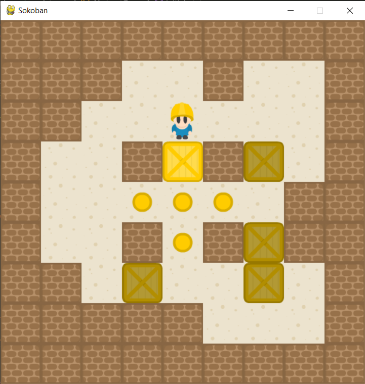
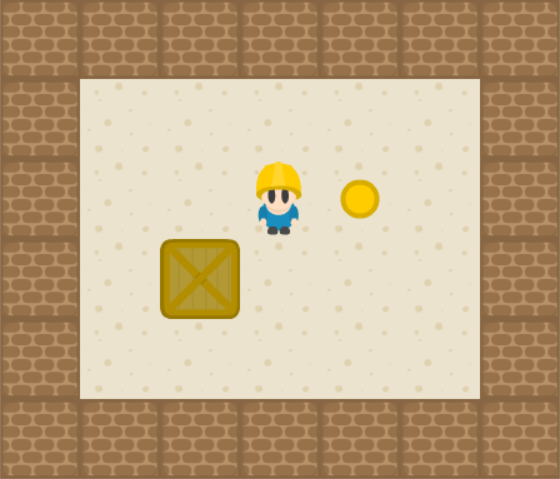

# Sokoban

In this part of the assignment, you write an agent that plays Sokoban. Your A* search from the [previous part](../README.md#1-a-search) of the assignment might be helpful.

To play the game you need to run [play_sokoban.py](play_sokoban.py). If you run it with no commands you can control Sokoban by yourself with keyboard arrows, key *B* for reverse last action, key *R* for restarting level and key *Esc* for exiting the game. Otherwise you can run the script with option `-h` to see all available options. Particularly you should be interested in option `-a Agent` which allows you to specify agent to control Sokoban.

## Game API

Before implementation you should check summary of the game API in [game/doc.md](game/doc.md).

## Assignment

You have to implement following:

### Dead square elimination

Implement function `detect` in [dead_square_detector.py](dead_square_detector.py) that creates list of dead squares — squares from which a box cannot possibly be pushed to any goal (even if Sokoban could teleport to any location).
You should prune the search at any point where a box is pushed to a dead square.

For example, in the following picture every square that is adjacent to a wall is dead:

Given a sokoban game state, `detect` should return a 2-dimensional structure (list of lists) of bools with the same dimension as given board. `detected[x][y]` should be `True` iff the corresponding square is dead.

To help you test your detector you can run [dead_square_test.py](dead_square_test.py), that should produce [this output](dead_squares_expected.txt) (or you can call `test` with suitable arguments for your need).

### A* agent

You should implement a non-trivial admissible, consistent heuristic to guide the A* search. 

First, create an instance of `HeuristicProblem` interface and then use A* search to find solution.

You can implement your agent into prepared script [agents/myagent.py](agents/myagent.py) or you can implement it in script named "agent_class_name_lowercase.py" in [agents](agents/) directory as a class implementing extending `ArtificialAgent`. Note that your implementation should not modify existing functionality. Since your agent function implementation will be called only once a game, this method is static. You can find an example in [agents/simple_agent.py](agents/simple_agent.py).

Your agent should be able to solve the puzzles in [game/levels/Aymeric_Medium.sok](game/levels/Aymeric_Medium.sok) in about 10 seconds per puzzle (this can differ a lot because of Python). To test your solver you can run

    python3 play_sokoban.py Aymeric_Medium -o

### Hints
- Use DFS or BFS for dead square detection. Start at target squares and search for squares that are alive.
- In implementation of `HeuristicProblem.result` you will need to clone the given board state, since it is supposed to leave existing state unchanged.
- There are many additional techniques and optimizations you could optionally implement. If you are interested in that, I recommend reading this [Sokoban Solver](http://pavel.klavik.cz/projekty/solver/solver.pdf) documentation written by a former MFF student. It suggests various useful ideas (only some of which the author implemented in his own program). If those aren't enough for you, the [Solver page](http://sokobano.de/wiki/index.php?title=Solver) on the Sokoban Wiki has many more ideas that could keep you busy for a while.

## Game controls
For visualization you press any key to see next move of the agent. When you play the game yourself, you use arrows for movement, **B** for stepping one move back and **R** to restart the level.
